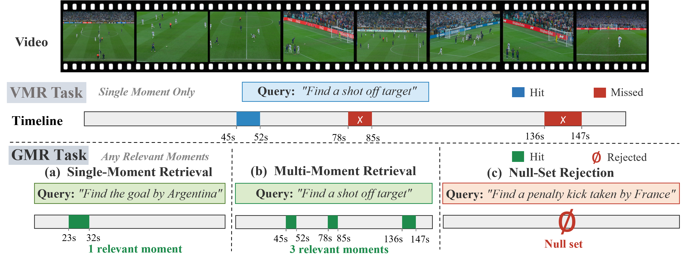
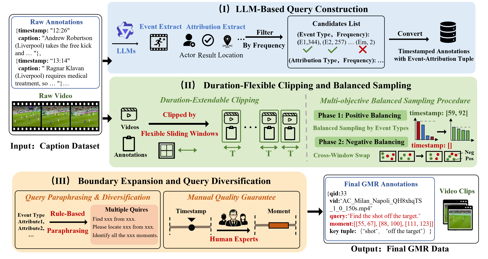
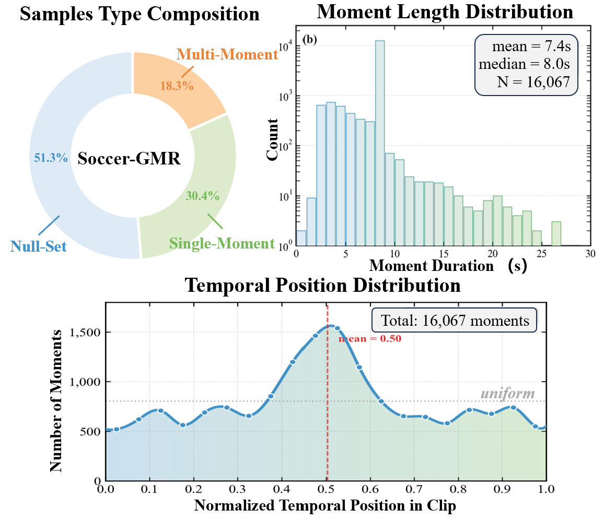
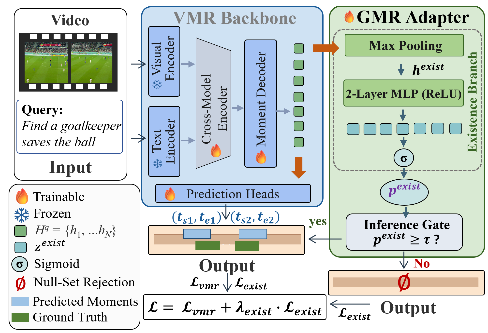

# Generalized Moment Retrieval


# Moment-DETR-GMR 综合数据全景表

本表汇总了当前 Moment-DETR-GMR 在测试集上的全面数据，包含任务参数、核心指标、细粒度错误分布及理想情况（Oracle）下的可修复上限。

| 数据维度 | 核心项目 / 指标 | 当前数据值 | 数据细节与上下文说明 | Oracle 理论上限 / 修复建议 |
| :--- | :--- | :--- | :--- | :--- |
| **I. 核心执行参数** | 模型架构 | **Moment-DETR-GMR** | 带有存在性预测头（`exist_head=True`） | - |
| | 数据集 / 分割 | **Soccer-GMR** | 测试集共 1036 个 Query (544正样本，492空集负样本) | - |
| | 视频/文本特征 | **CLIP + SlowFast** | video_feat_dim=2818, text_feat_dim=512 | - |
| | 训练状态 | **Epoch 38 / 89** | 触发早停。验证集 MR-full-mAP 最高达 8.97 | - |
| **II. 测试集表现 (默认阈值 $\tau=0.4$)** | AUROC | **70.00%** | 与阈值无关的分类判别能力，接近论文 Baseline (72.09%) | - |
| | Rej-F1 | **0.00%** | **严重异常**：所有负样本的预测得分均大于 0.4，无一触发拒答。 | 将 $\tau$ 提至 0.6 可升至 **72.98%** |
| | G-mIoU@1 | **4.49%** | 受误报拖累，全局指标崩塌（远低于论文 35.84%）。 | 将 $\tau$ 提至 0.55 可升至 **39.31%** |
| | G-mIoU@3 | **2.12%** | 同上，受拒答门控失效影响。 | - |
| | mAP | **8.09%** | 纯正样本集的定位精度，略高于论文 Baseline (7.52%)。 | Fix Boundary 可达 **100%** |
| | mR@5 | **14.14%** | 平均召回率（前 5 个预测中命中的真值比例）。 | - |
| | mR+@5 | **0.97%** | **严重偏低**：增量多目标召回率。说明找不全同类动作。 | - |
| **III. 细粒度错误分布 (Failure Modes)** | 1. 拒答误报 (Rejection FP) | **100% (492/492)** | 在 $\tau=0.4$ 时，所有的空集负样本都被模型强制分配了动作框。负样本得分均值高达 0.518。 | **首要修复方向**：修复后 G-mIoU@1 增益可达 **+11.87%**，突破 51% |
| | 2. 拒答漏报 (Rejection FN) | **0% (0/544)** | 在 $\tau=0.4$ 时无漏报；但若阈值调至 0.55，会产生 238 个漏报（误杀43.8%的正样本）。 | 阈值校准 (Calibration) 平衡 FP/FN |
| | 3. 预测过载 (Over-detection) | **100% (544/544)** | 所有的正样本查询，模型都输出了大量多余且无用的预测框。额外预测平均得分为 0.447。 | **次要修复方向**：修复后 G-mIoU@1 增益达 **+18.92%** |
| | 4. 多目标漏检 (Multi-miss) | **85.6% 漏检** | 在 160 个多目标查询中，只有 36 个 (22.5%) 命中了后续片段，14.4% 仅命中第一个（发生坍缩）。 | 改进 Decoder 多样性机制，当前难以通过简单后处理修复。 |
| | 5. 边界不精 (Boundary Near-miss) | **6.3% 近失误** | $0.3 \le IoU < 0.5$ 的不精确匹配。匹配框的平均 IoU 仅为 0.27 (部分记录甚至低至 0.09)。 | **定位修复方向**：时序边界回归微调，修复后 mAP 增益可达 **+30.74%** |


   评估维度   │ 指标项   │ 纯血版 Baseline (无… │ 之前的错误版 Idea 1… │ 现在修复后的 Idea 1 (双轨制放行)
  ────────────┼──────────┼──────────────────────┼──────────────────────┼──────────────────────────────────
   打假拒答   │          │ 0.00%                │ 74.50%               │ 74.50%
   端到端大考 │ G-mIoU@1 │ 4.49%                │ 51.76%               │ 50.83% (保住了巨大收益)
   单目标定位 │ mAP      │ 8.09%                │ 3.24%                │ 7.11% (成功满血复活！)
              │ mR@5     │ 14.14%               │ 4.38%                │ 10.27% (大幅回升)
   多目标增量 │ mR+@5    │ 0.97%                │ 0.00%                │ 1.12% (超越 Baseline！)
Official repository for **Retrieving Any Relevant Moments: Benchmark and Models for Generalized Moment Retrieval**.

**Generalized Moment Retrieval (GMR)** extends video moment retrieval to a unified setting where a query may correspond to **no moment**, **one moment**, or **multiple moments** in a video. A GMR system must retrieve the complete set of relevant temporal moments, or correctly return an empty set when the queried event is absent.

<div align="center">
  <a href="https://arxiv.org/abs/2605.02623"></a>
  <a href="https://dymm9977.github.io/generalized-moment-retrieval/"></a>
  <a href="https://huggingface.co/datasets/diiiA22B9S/Soccer-GMR"></a>
</div>



## Task

Traditional Video Moment Retrieval (VMR) commonly assumes that every query has exactly one matching temporal segment. This assumption is too restrictive for realistic retrieval: an event can be absent, occur once, or occur repeatedly within the same video.

GMR unifies these cases into one retrieval task:

- **Null-set rejection**: return an empty set when the event does not appear.
- **Single-moment retrieval**: retrieve the only relevant temporal segment.
- **Multi-moment retrieval**: retrieve all relevant temporal segments.

The output for each query is a set of temporal windows:

```json
{
  "qid": 580,
  "pred_relevant_windows": [[26.0, 34.0, 0.91], [104.0, 112.0, 0.87]],
  "pred_exist_score": 0.95
}
```

## Pipeline

Soccer-GMR is built through a duration-flexible semi-automated data construction pipeline with human verification. The pipeline converts timestamped soccer event supervision into generalized moment retrieval annotations by constructing natural-language queries, sampling positive and in-domain negative query-video pairs, and normalizing temporal annotations into evaluation-ready windows.



The duration-flexible design allows the benchmark to scale from fixed 150-second clips to longer video horizons by merging adjacent clips while preserving moment-level supervision.

## Dataset

**Soccer-GMR** is a large-scale GMR benchmark built on challenging soccer videos. It includes realistic positive and negative query-video pairs and covers all three retrieval scenarios in a unified format.


| Split group | Purpose | Files |
| --- | --- | --- |
| `data/label/Standard/` | Benchmark split used for evaluation | `train.jsonl`, `val.jsonl`, `test.jsonl` |
| `data/label/Full/` | Complete dataset used for scaling studies | `train.jsonl`, `val.jsonl`, `test.jsonl`, `full.jsonl` |

Dataset statistics:

| Split group | Train | Val | Test | Total | Videos |
| --- | ---: | ---: | ---: | ---: | ---: |
| `Standard` | 4,138 | 465 | 1,036 | 5,639 | 1,957 |
| `Full` | 16,898 | 2,235 | 2,986 | 22,119 | 5,468 |

For details about label fields and directory organization, see [`data/README.md`](data/README.md). Large assets, including videos, features, and model weights, are hosted on [Hugging Face](https://huggingface.co/datasets/diiiA22B9S/Soccer-GMR). Access is manually reviewed after the requester completes the Soccer-GMR NDA form. Commercial use, redistribution, public hosting, or sharing access links is not permitted.

<p align="center">
  
</p>

## Metrics

GMR evaluation requires measuring both rejection and localization. The official evaluation toolkit is provided in [`eval/`](eval/).

The evaluation protocol reports:

- **Null-set rejection**: AUROC, Rej-F1, Acc
- **Temporal localization on positive queries**: mAP, mR@k, mR+@k, mIoU@k, mIoU+@k
- **End-to-end GMR performance**: G-mIoU@k

Run the example evaluation:

```bash
python eval/eval_main.py \
  --submission_path eval/example/example_test_submission.jsonl \
  --gt_path data/label/Standard/test.jsonl \
  --save_path eval/example/example_test_results.json
```

For input formats, metric definitions, and command-line options, see [`eval/README.md`](eval/README.md).

## Methods

The paper studies GMR across two modeling paradigms. This repository currently releases the feature-level implementation of **Moment-DETR-GMR**, a Moment-DETR baseline augmented with the GMR Adapter.

**GMR Adapter** is a lightweight plug-and-play module for discriminative VMR backbones. It adds an explicit existence-estimation branch for null-set prediction while preserving the temporal localization backbone. The released Moment-DETR-GMR code pools decoder query representations, predicts `pred_exist_score`, and uses binary existence supervision derived from whether `relevant_windows` is empty.



Training and inference entry points are provided in [`training/moment_detr_gmr/`](training/moment_detr_gmr/), with runnable script templates in [`scripts/`](scripts/).

**GMR-tailored GRPO Reward** adapts reinforcement learning for generative multimodal large language models by jointly rewarding correct rejection behavior and temporal localization quality.

## Main Results

The main results below are reported on the Soccer-GMR `Standard` benchmark split.

| Model | AUROC | Rej-F1 | mAP | mR@5 | mR+@5 | G-mIoU@1 | G-mIoU@3 |
| --- | ---: | ---: | ---: | ---: | ---: | ---: | ---: |
| Moment-DETR | 69.92 | 0.00 | 6.98 | 10.92 | 0.78 | 5.39 | 2.47 |
| Moment-DETR-GMR | 72.09 | **64.01** | 7.52 | 12.96 | 0.84 | 35.84 | 32.89 |
| EaTR | 70.99 | 0.80 | 18.48 | 25.27 | 11.81 | 12.94 | 6.67 |
| EaTR-GMR | **79.11** | 62.10 | 18.56 | 24.43 | 13.97 | 37.89 | 31.95 |
| FlashVTG | 57.33 | 7.12 | 23.61 | 33.06 | 15.30 | 15.41 | 8.21 |
| FlashVTG-GMR | 74.00 | 61.72 | **24.62** | **33.36** | **19.10** | **39.58** | **33.53** |

## Repository Structure

```text
Generalized_Moment_Retrieval/
|-- README.md
|-- LICENSE
|-- CITATION.cff
|-- requirements.txt
|-- assets/
|   |-- intro.png
|   |-- pipeline222.png
|   |-- dataset.png
|   `-- adapter10.png
|-- data/
|   |-- README.md
|   `-- label/
|       |-- Full/
|       `-- Standard/
|-- eval/
|   |-- README.md
|   |-- eval_main.py
|   |-- metrics.py
|   |-- normalization.py
|   |-- utils.py
|   `-- example/
|-- configs/
|   `-- moment_detr_gmr/
|-- models/
|   `-- moment_detr_gmr/
|-- training/
|   `-- moment_detr_gmr/
|-- scripts/
|   |-- train_moment_detr_gmr.sh
|   `-- infer_moment_detr_gmr.sh
|-- docs/
|   |-- index.html
|   |-- styles.css
|   `-- script.js
`-- pipeline/
```

## Installation

```bash
pip install -r requirements.txt
```

PyTorch installation can vary by CUDA version. If needed, install the matching PyTorch build from the official PyTorch instructions before installing the rest of the requirements.

## Moment-DETR-GMR

Train with precomputed CLIP text features and CLIP + SlowFast video features:

```bash
bash scripts/train_moment_detr_gmr.sh
```

Run inference with a trained checkpoint:

```bash
bash scripts/infer_moment_detr_gmr.sh
```

The scripts can be configured with `MODEL_PATH`, `TEXT_FEAT_DIR`, `CLIP_FEAT_DIR`, `SLOWFAST_FEAT_DIR`, and `RESULTS_DIR`.

## Citation

If you find this repository useful, please cite our paper:

```bibtex
@article{ding2026retrieving,
  title={Retrieving Any Relevant Moments: Benchmark and Models for Generalized Moment Retrieval},
  author={Ding, Yiming and Cao, Siyu and Jiao, Luyuan and Li, Yixuan and Wang, Zitong and Liu, Zhiyong and Zhang, Lu},
  journal={arXiv preprint arXiv:2605.02623},
  year={2026},
  doi={10.48550/arXiv.2605.02623}
}
```
